#  Pavel Rukin • Android Developer

> Crafting beautiful Android apps with Kotlin | Material Design • Clean Architecture • Performance

---

## 💡 About

Android developer with experience in iOS
Focused on writing clean, maintainable code and building
apps that are stable and user-friendly.
Worked with KMM shared modules to reuse business
logic across Android and iOS.
Able to take projects from idea to release and collaborate
effectively in a team.

**What I do:**
- 🎨 Beautiful UI/UX with Material 3 & Jetpack Compose
- 🏗️ Scalable architecture (MVVM, CLEAN, MVI patterns)
- ⚡ Performance optimization & profiling
- 🧪 Comprehensive testing (Unit, Integration, UI)
- 📚 Knowledge sharing & mentoring

---

## 🛠️ Tech Stack
 
### 📱 Language & Framework

 
### 🏗️ Architecture & Patterns

 
### 🚀 Jetpack Components

 
### 🌐 Networking & Data

 
### ⚡ Async & Reactive

 
### 🧪 Testing

--- 

## 🤝 Let's Connect

 
---
 
